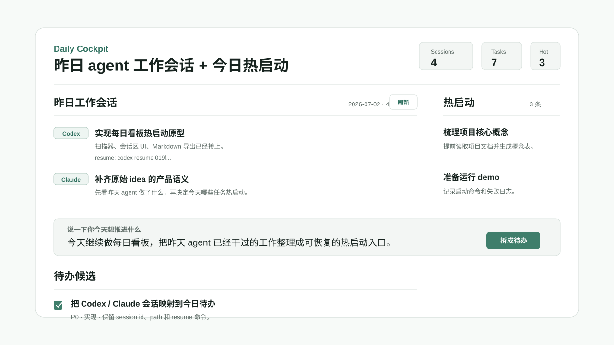

<div align="center">
  <picture>
    <source media="(prefers-color-scheme: dark)" srcset=".github/logo-dark.svg">
    <source media="(prefers-color-scheme: light)" srcset=".github/logo-light.svg">
    
  </picture>

  <h1>Daily Cockpit</h1>
  <p>Turn one loose plan into tomorrow's selectable AI hot-start tasks inside Obsidian.</p>
</div>

<div align="center">

[![License: MIT][license-shield]][license-url]
[![Obsidian][obsidian-shield]][obsidian-url]
[![Local Model][local-model-shield]][local-model-url]

</div>

<div align="center">
  <a href="#quick-start">Quick Start</a> &middot;
  <a href="#usage">Usage</a> &middot;
  <a href="#local-model">Local Model</a> &middot;
  <a href="#verification">Verification</a>
</div>

---



## Why

AI makes it easy to keep opening new threads at night and then wake up cold. The missing step is not another kanban board; it is a small bridge from "what I want to do tomorrow" to concrete tasks that an AI can prepare before you sit down.

Daily Cockpit keeps that bridge simple: write one natural-language intent, let a local model decompose it into todos, then explicitly choose which todos become hot-start candidates.

## Features

- **Intent-first input**: paste or type a rough Chinese or English plan instead of managing statuses.
- **Local-model decomposition**: calls an OpenAI-compatible chat endpoint and expects structured JSON tasks.
- **Selectable Hot Start**: each generated todo has a checkbox; only selected tasks enter the hot-start list.
- **Prep-oriented fields**: tasks include priority, category, detail, and a `warmStart` action suitable for background research, reading, or experiments.
- **Obsidian-native export**: writes `Daily Cockpit/YYYY-MM-DD.md` with the original intent, selected hot starts, and all candidates.
- **Simple full-window view**: one input, one candidate list, one hot-start list. No inbox, no daily state machine, no generic todo board.

## Quick Start

```bash
npm install
npm run build
npm run install:local -- --vault "$HOME/Knowledge/Obsidian"
```

Open Obsidian, then run **打开每日热启动** from the command palette or click the ribbon icon.

## Install

Daily Cockpit is currently installed manually as a development/community plugin:

```bash
git clone https://github.com/WdBlink/daily-cockpit.git
cd daily-cockpit
npm install
npm run build
npm run install:local -- --vault "/path/to/your/vault"
```

The install script copies `main.js`, `styles.css`, and `manifest.json` into:

```text
<vault>/.obsidian/plugins/daily-cockpit/
```

It also enables `daily-cockpit` in `.obsidian/community-plugins.json` when needed.

## Usage

Daily Cockpit adds one view, one ribbon action, and three commands:

| Entry point | What it does |
| --- | --- |
| `打开每日热启动` | Opens the full-window decomposition view |
| Ribbon icon | Opens the same view |
| `快速拆解待办` | Opens a modal for one quick intent |
| `导出热启动清单` | Writes `Daily Cockpit/YYYY-MM-DD.md` in the current vault |

Basic flow:

1. Describe tomorrow's goal in one paragraph.
2. Click **拆成待办**.
3. Review the generated candidate todos.
4. Check the todos suitable for hot-start preparation.
5. Export the Markdown note when you want a durable handoff.

## Local Model

By default, the plugin calls:

```text
http://127.0.0.1:11434/v1/chat/completions
```

The default model name is `qwen2.5:7b`. You can change endpoint, model, API key, and export folder in the plugin settings.

The code does not include a public LLM host or hardcoded API key. If you point the endpoint at a remote provider, that is your explicit configuration.

## Roadmap

The first working scope is the evening flow: intent decomposition and selected hot-start tasks.

The original product idea also includes a morning flow: summarize yesterday's local agent sessions, surface session IDs/paths, and show which hot-start tasks already have preparation work attached. That belongs in the next version after the simple planner is stable.

## Verification

```bash
npm run lint
npm test
npm run test:e2e
npm run install:local -- --vault "$HOME/Knowledge/Obsidian"
npm run verify:local -- --vault "$HOME/Knowledge/Obsidian"
```

`npm run test:e2e` checks the browser harness at 320px, 768px, 1024px, and 1440px and fails if the interface creates horizontal overflow.

## License

MIT

[license-shield]: https://img.shields.io/badge/license-MIT-3f7e6b.svg
[license-url]: LICENSE
[obsidian-shield]: https://img.shields.io/badge/Obsidian-plugin-3f7e6b.svg
[obsidian-url]: https://obsidian.md
[local-model-shield]: https://img.shields.io/badge/model-localhost%20default-3f7e6b.svg
[local-model-url]: #local-model
