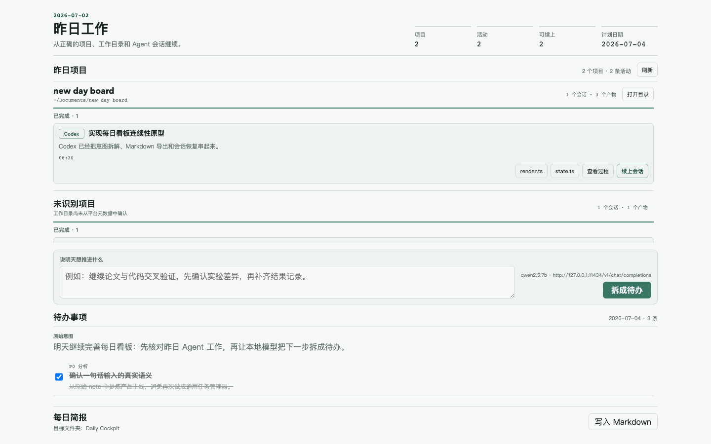
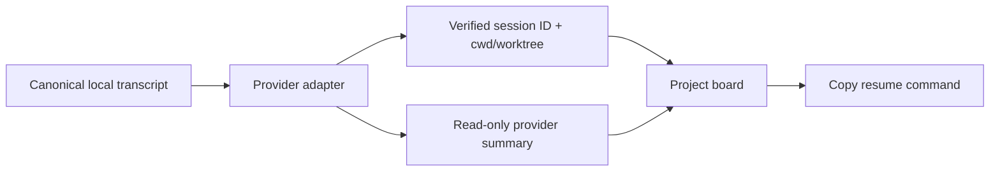

<div align="center">
  <picture>
    <source media="(prefers-color-scheme: dark)" srcset=".github/logo-dark.svg">
    <source media="(prefers-color-scheme: light)" srcset=".github/logo-light.svg">
    
  </picture>

  <h1>Agent Whiteboard</h1>
  <p><strong>Keep local coding Agents, project context, and working notes on one persistent Obsidian canvas.</strong></p>
  <p>An Obsidian desktop plugin for spatially organizing Codex and Claude Code work while provider CLIs remain the owners of sessions and transcripts.</p>
</div>

<div align="center">

[![License: MIT][license-shield]][license-url]
[![Obsidian Desktop][obsidian-shield]][obsidian-url]
[![Local-first][local-shield]][local-url]
[![Tests][tests-shield]][tests-url]

</div>

<div align="center">
  <a href="#macos-install">macOS Install</a> &middot;
  <a href="#agent-whiteboard">Agent Whiteboard</a> &middot;
  <a href="#session-recovery">Session Recovery</a> &middot;
  <a href="#local-model">Local Model</a> &middot;
  <a href="#verification">Verification</a>
</div>

---



## Agent Whiteboard

```text
Register a local project
        -> create Codex, shell, or Markdown note nodes
        -> arrange and resize work spatially
        -> connect related nodes
        -> reopen Obsidian with the same board and viewport
```

Version `0.3.0` places every registered project frame on one global React Flow canvas with no project switcher. Explicit project ownership, frame movement and resize containment, notes, headings, edges, viewport persistence, embedded Codex/shell PTYs, and selectable Codex/Claude Code history readers are implemented.

## What It Does

- **Global project canvas** registers canonical local directories inside or outside the active vault and shows every project frame together.
- **Infinite canvas** provides pan, zoom, selection, node resizing, deletion, and directed connections.
- **Codex Agent nodes** launch an argv-only Codex CLI inside an embedded xterm at the project's exact working directory.
- **Shell terminal nodes** launch the configured shell in the same isolated, project-scoped PTY runtime.
- **Markdown note nodes** switch between source editing and Obsidian-rendered preview.
- **Spatial headings** appear at a blank-canvas double-click with large serif typography, descender-safe spacing, and persistent preset color swatches.
- **Durable spatial state** restores the global board, committed revision, viewport, frames, explicit ownership, dimensions, z-order, notes, and edges from plugin data.
- **Daily Cockpit legacy view** remains available while the whiteboard runtime is developed.
- **Verified recovery commands** copy a shell-safe `cd <workspace> && codex resume <id>` or `cd <workspace> && claude --resume <id>` command.
- **Artifact and process actions** open local outputs, reveal the transcript, or open the exact project directory.
- **Provider-authored summaries** let Codex summarize Codex sessions and Claude Code summarize Claude sessions only after an explicit refresh.
- **Selectable read sources** let you enable Codex, Claude Code, both, or neither; disabled providers are not scanned.
- **Tomorrow planning** sends one natural-language intent to an OpenAI-compatible endpoint and stores a dated list of ordinary tasks.
- **Stable long-list interaction** keeps internal scroll position, focused control, selection range, and an unsubmitted draft across updates.
- **Obsidian export** writes one dated Markdown brief containing previous work, tomorrow's intent, and tasks.

Claude Code launch remains explicitly unavailable in this slice. The whiteboard does not schedule background work, persist terminal scrollback or runtime identity, or automatically populate historical sessions.

## macOS Install

Version `0.3.0` supports macOS only. Download the matching archive from [GitHub Releases](https://github.com/WdBlink/daily-cockpit/releases):

- Apple Silicon (M1 and later): `agent-whiteboard-v0.3.0-macos-arm64.zip`
- Intel Mac: `agent-whiteboard-v0.3.0-macos-x64.zip`

Unzip it, double-click **Install Agent Whiteboard.command**, select your Obsidian vault, then enable **Agent Whiteboard** in **Obsidian → Settings → Community plugins**. The archive also includes a manually installable `daily-cockpit` folder and `SHA256SUMS.txt` is published beside both downloads.

The guided installer copies plugin and native runtime files without deleting or replacing an existing `data.json`. This first release is not signed or notarized; if macOS blocks the installer, Control-click it and choose **Open** after confirming it came from this repository.

## Quick Start From Source

```bash
git clone https://github.com/WdBlink/daily-cockpit.git
cd daily-cockpit
npm install
npm run build
npm run install:local -- --vault "/path/to/your/vault"
```

Open Obsidian and run **打开 Agent Whiteboard** from the command palette. Add project paths to the same global canvas, then use a frame's context menu to start a Codex session or shell terminal at that project's exact path. Claude Code reports an explicit unavailable state. Add notes from the frame controls and double-click blank canvas space to type a spatial heading. **打开 Daily Cockpit** remains available for the completed continuity POC.

## Source Install

The installer copies `main.js`, `styles.css`, `manifest.json`, the versioned PTY host, and the current-platform pruned `node-pty` runtime to:

```text
<vault>/.obsidian/plugins/daily-cockpit/
```

It preserves existing plugin data, migrates it to schema version 4, clears stale runtime truth, adds an empty whiteboard store when needed, and enables the plugin without rewriting malformed Obsidian configuration. `verify:local` hashes the packaged host and native assets and rejects unexpected runtime files.

## Usage

| Entry point | Result |
| --- | --- |
| `打开 Agent Whiteboard` | Opens the persistent global canvas with every project frame and no project switcher |
| `打开 Daily Cockpit` | Opens the full-window continuity board |
| `刷新昨日工作会话` | Re-indexes the previous local day and optionally asks each provider for a summary |
| `快速拆解待办` | Opens a compact intent modal |
| `导出每日简报` | Writes the active plan's target-date Markdown note |
| `续上会话` | Copies, but never executes, the verified recovery command |

## Session Recovery

The plugin separates generated understanding from local identity:



Only canonical platform metadata can authorize recovery. A UUID in a filename or task directory is insufficient. Generated summaries may update title, summary, artifacts, and status; unknown IDs and generated path changes are discarded.

Default roots:

```text
~/.codex/sessions
~/.codex/archived_sessions
~/.claude/projects
```

In **Settings → Daily Cockpit → 读取 Codex / Claude Code 会话**, each provider can be enabled independently. The selection is stored locally and applies before filesystem discovery, so turning a provider off prevents its session directories from being traversed.

Activity belongs to the previous local calendar day by event timestamp when available. File modification time is only a bounded discovery hint, so a cross-midnight session can still be attributed correctly.

## Local Model

Tomorrow's intent is decomposed through an OpenAI-compatible chat-completions endpoint. Defaults:

```text
Endpoint: http://127.0.0.1:11434/v1/chat/completions
Model:    qwen2.5:7b
```

The model returns only `title`, `detail`, `category`, and `priority`. Completion state belongs to the user and is never selected by the model.

The default endpoint is loopback and no public host or API key is embedded. Configuring a remote endpoint is an explicit user choice.

## Privacy And Safety

- Startup performs no provider summary call.
- Metadata-only mode starts no Codex or Claude process.
- A provider receives only its own transcript manifest.
- Recovery controls only copy commands. New Codex and shell nodes execute only their fixed argv launch specifications through the isolated PTY gateway.
- Dynamic shell values pass through centralized quoting.
- Runtime environment filtering removes credential-like variables before launch.
- Terminal scrollback, process IDs, and live runtime identity remain in memory and are never written to plugin data.
- Snapshots and task plans remain in Obsidian's local plugin data.

## Development

```bash
npm run dev
npm run build
```

The implementation uses TypeScript, Obsidian `ItemView`, React 19, `@xyflow/react`, xterm, Lucide icons, a system-Node `node-pty` companion, local Electron filesystem access, and the existing Daily Cockpit DOM renderer. Electron never loads `pty.node`.

## Verification

```bash
npm run check
npm run test:runtime-host
npm run test:obsidian -- --vault "/path/to/your/vault" --model qwen2.5:7b
npm run verify:local -- --vault "/path/to/your/vault"
```

`npm run check` runs type checking, privacy and README checks, the Node unit/integration suite, and the Playwright browser suite, including responsive coverage at 320, 768, 1024, and 1440 pixels. `npm run test:runtime-host` separately launches two real PTYs from temporary Unicode paths and verifies isolation, resize acknowledgement, and shutdown cleanup.

The optional whiteboard-only real Obsidian runner performs controlled process relaunches, uses visible project/context-menu/zoom controls, verifies provider launch count remains zero, aborts and joins timed-out mutators, records durable evidence with independent recovery budgets, and restores managed vault files only after process and mutation quiescence. It does not execute provider runtimes.

See [TESTING.md](TESTING.md) for prerequisites and the manual acceptance checklist.

## Acknowledgements

The spatial Agent workspace is informed by [OpenCove](https://github.com/DeadWaveWave/opencove), especially its project-scoped canvas and terminal-node model. The local, visible, resumable work-memory direction was also informed by [FanBox](https://github.com/alchaincyf/fanbox). This plugin keeps its own Obsidian-specific product and does not present either project as an official dependency or distribution.

## License

MIT

[license-shield]: https://img.shields.io/badge/license-MIT-397664.svg
[license-url]: LICENSE
[obsidian-shield]: https://img.shields.io/badge/Obsidian-desktop-7c3aed.svg
[obsidian-url]: https://obsidian.md
[local-shield]: https://img.shields.io/badge/data-local--first-397664.svg
[local-url]: #privacy-and-safety
[tests-shield]: https://img.shields.io/badge/tests-verified-956b22.svg
[tests-url]: #verification
