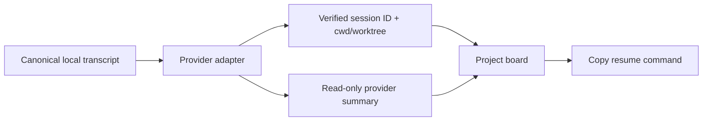

<div align="center">
  <picture>
    <source media="(prefers-color-scheme: dark)" srcset=".github/logo-dark.svg">
    <source media="(prefers-color-scheme: light)" srcset=".github/logo-light.svg">
    
  </picture>

  <h1>Daily Cockpit</h1>
  <p><strong>Pick up yesterday's Agent work without reconstructing it from terminal history.</strong></p>
  <p>An Obsidian desktop plugin for reviewing local Codex and Claude Code sessions, copying verified recovery commands, and turning tomorrow's intent into a short task list.</p>
</div>

<div align="center">

[![License: MIT][license-shield]][license-url]
[![Obsidian Desktop][obsidian-shield]][obsidian-url]
[![Local-first][local-shield]][local-url]
[![Tests][tests-shield]][tests-url]

</div>

<div align="center">
  <a href="#quick-start">Quick Start</a> &middot;
  <a href="#session-recovery">Session Recovery</a> &middot;
  <a href="#local-model">Local Model</a> &middot;
  <a href="#verification">Verification</a>
</div>

---


## The Loop

```text
Yesterday's local Agent activity
        -> grouped by project and status
        -> inspect artifacts or transcript
        -> copy a verified resume command
        -> describe tomorrow in one paragraph
        -> receive ordinary, completable tasks
```

Daily Cockpit is intentionally a continuity layer, not another general task manager. The previous-work board is the primary surface. The intent composer stays compact and secondary.

## What It Does

- **Project-first morning board** groups sessions by workspace or worktree, with provider shown as a source label.
- **Status lanes** separate work that needs attention, remains active, is complete, or lacks a reliable status.
- **Verified recovery commands** copy a shell-safe `cd <workspace> && codex resume <id>` or `cd <workspace> && claude --resume <id>` command.
- **Artifact and process actions** open local outputs, reveal the transcript, or open the exact project directory.
- **Provider-authored summaries** let Codex summarize Codex sessions and Claude Code summarize Claude sessions only after an explicit refresh.
- **Tomorrow planning** sends one natural-language intent to an OpenAI-compatible endpoint and stores a dated list of ordinary tasks.
- **Stable long-list interaction** keeps internal scroll position, focused control, selection range, and an unsubmitted draft across updates.
- **Obsidian export** writes one dated Markdown brief containing previous work, tomorrow's intent, and tasks.

The current POC does not schedule work, launch Agents, embed a terminal, or provide an infinite canvas.

## Quick Start

```bash
git clone https://github.com/WdBlink/daily-cockpit.git
cd daily-cockpit
npm install
npm run build
npm run install:local -- --vault "/path/to/your/vault"
```

Open Obsidian and run **打开 Daily Cockpit** from the command palette, or use the ribbon icon.

## Install

The installer copies `main.js`, `styles.css`, and `manifest.json` to:

```text
<vault>/.obsidian/plugins/daily-cockpit/
```

It preserves existing plugin data, migrates it to schema version 3, removes retired non-session roots, and enables the plugin without rewriting malformed Obsidian configuration.

## Usage

| Entry point | Result |
| --- | --- |
| `打开 Daily Cockpit` | Opens the full-window continuity board |
| `刷新昨日工作会话` | Re-indexes the previous local day and optionally asks each provider for a summary |
| `快速拆解待办` | Opens a compact intent modal |
| `导出每日简报` | Writes the active plan's target-date Markdown note |
| `续上会话` | Copies, but never executes, the verified recovery command |

## Session Recovery

The plugin separates generated understanding from local identity:



Only canonical platform metadata can authorize recovery. A UUID in a filename or task directory is insufficient. Generated summaries may update title, summary, artifacts, and status; unknown IDs and generated path changes are discarded.

Default roots:

```text
~/.codex/sessions
~/.codex/archived_sessions
~/.claude/projects
```

Activity belongs to the previous local calendar day by event timestamp when available. File modification time is only a bounded discovery hint, so a cross-midnight session can still be attributed correctly.

## Local Model

Tomorrow's intent is decomposed through an OpenAI-compatible chat-completions endpoint. Defaults:

```text
Endpoint: http://127.0.0.1:11434/v1/chat/completions
Model:    qwen2.5:7b
```

The model returns only `title`, `detail`, `category`, and `priority`. Completion state belongs to the user and is never selected by the model.

The default endpoint is loopback and no public host or API key is embedded. Configuring a remote endpoint is an explicit user choice.

## Privacy And Safety

- Startup performs no provider summary call.
- Metadata-only mode starts no Codex or Claude process.
- A provider receives only its own transcript manifest.
- Recovery controls copy commands; they do not launch a terminal or execute anything.
- Dynamic shell values pass through centralized quoting.
- Snapshots and task plans remain in Obsidian's local plugin data.

## Development

```bash
npm run dev
npm run build
```

The implementation uses TypeScript, Obsidian's `ItemView`, local Electron filesystem access, and a small DOM renderer with explicit interaction-state restoration.

## Verification

```bash
npm run check
npm run test:obsidian -- --vault "/path/to/your/vault" --model qwen2.5:7b
npm run verify:local -- --vault "/path/to/your/vault"
```

`npm run check` runs type checking, privacy and README checks, 48 unit/integration tests, and 12 Playwright browser tests across 320, 768, 1024, and 1440 pixel widths.

The real Obsidian E2E installs the current build, restarts Obsidian, clicks the actual refresh and export controls, calls an actual local model, verifies the macOS clipboard, and resumes the same real Codex session through `codex exec resume`. It restores the original plugin data afterward.

See [TESTING.md](TESTING.md) for prerequisites and the manual acceptance checklist.

## Acknowledgements

The local, visible, resumable work-memory direction was informed by [FanBox](https://github.com/alchaincyf/fanbox). Daily Cockpit does not reproduce its file manager, terminal, replay system, or broader cockpit.

## License

MIT

[license-shield]: https://img.shields.io/badge/license-MIT-397664.svg
[license-url]: LICENSE
[obsidian-shield]: https://img.shields.io/badge/Obsidian-desktop-7c3aed.svg
[obsidian-url]: https://obsidian.md
[local-shield]: https://img.shields.io/badge/data-local--first-397664.svg
[local-url]: #privacy-and-safety
[tests-shield]: https://img.shields.io/badge/tests-60%20checks-956b22.svg
[tests-url]: #verification
