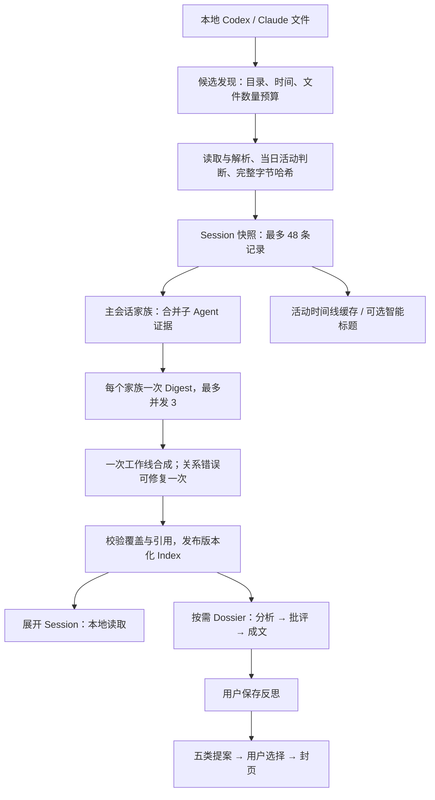

# Agent Notebook 全链路审查

审查日期：2026-09-06。对象：当前工作区的 Electron 主进程、React 界面、Session 扫描与解析、Structured Today V1 默认链路及 V2 候选链路。业务代码未修改；原有未提交改动保留。

**结论：现有确定性工作流、不可变资产和版本校验值得保留，但输入预算、失败恢复、证据回开及草稿生命周期存在已复现缺陷。性能优先级应放在消除重复扫描、重复推理和全库进度写入，暂不增加新的语义流水线或更换工作流框架。**

这里的“最优”应以正确性、证据完整性、交互延迟、模型调用量和长期维护成本共同衡量。不能仅以代码行数、并行数或节点数作判断；本次没有进行真实模型质量对比，也没有测得优化后的提速比例。

## 1. 当前真实的数据流



默认入口见 `app/desktop/main.ts:104`、`:927`。`AGENT_NOTEBOOK_STRUCTURED_TODAY=0` 保留旧 Traceink producer；消息级 V2 必须在非打包环境显式开启，仍是候选，不能把候选能力当成用户已经获得的能力。

用户提到的阶段与当前实现对应如下：

| 名称 | 当前实际情况 | 审查判断 |
|---|---|---|
| 结构化 | Zod 契约、版本化 Index / Dossier / Reflection / Proposal | 已有明确边界，应保留 |
| 预筛 | 文件发现、日期条件、数量预算、家族归并、读取失败 disposition | 是确定性筛选，尚无独立语义预筛模型 |
| 精选 | 工作线合成；用户选一条深入分析 | 没有单独的精选打分节点 |
| 摘要 | 家族 Digest；另有 Session 智能标题 | 两种产物承担不同界面用途，但有重复读取/调用成本 |
| 事件 | Provider 事件用于消息和活动窗口解析；V2 有 atomic findings | 没有正式独立的语义事件存储层 |
| 聚簇 | V1 的跨 Session 工作线 synthesis | 没有独立聚簇服务；Timeline 主要是 Session 投影 |

成功情况下，F 个家族的 Index 需要 F + 1 次模型节点调用；触发一次关系修复则为 F + 2。查看一个新 Dossier 再增加 3 次串行调用，整理反思再增加 1 次。这里统计应用发起的 CLI 语义节点，不等于 Provider 内部推理或工具回合数。已有 Dossier 的重开复用资产。额外插入“预筛模型→精选模型→事件模型→聚簇模型”会增加关键路径，当前没有证据支持这样做。

## 2. 优先修复的问题

P1 表示直接影响数据、证据可靠性或主要功能；P2 表示性能、可用性或随规模放大的问题。下面的复现使用合成数据与假 Provider，未读取真实会话内容。

### P1-1：摘要失败后，“重试”会反复复用失败结果

**已复现。** 第一次假 Provider 失败，第二次已恢复，但模型新增调用数为 **0**，仍报 publication gate 失败。

`src/structured-today-langgraph.ts:552` 的 `executeDigest` 将异常转换为 `status: failed` 返回；图正常运行到终点，生成不可发布的 output。`app/desktop/structured-today-runtime.ts:137` 看到 checkpoint 就执行 `invoke(null)`，已完成图不会自动重做这个失败业务结果。输入、模型、版本和 revision 未改变时，run ID 也不变；只要这份 checkpoint 仍被保留，普通重试就无法解除该状态。

需要区分“节点抛错、等待恢复”和“图完成、业务校验失败”。保留已成功的家族 Digest，只重新调度失败家族；终局语义无效结果必须有明确重建路径。仅删除整个 checkpoint 可以解除卡死，但会重复付费，适合作为临时兜底而非最终策略。

验收：一次暂时性 Digest 失败后，再次操作成功；成功家族的调用次数不增加。现有测试覆盖了 synthesis 抛错恢复，未覆盖这种终局失败结果的重试。

### P1-2：输入预算不仅失效，还会把消息复制两遍

**已复现。** 4000 条短消息经过预算裁剪后变成 **8001 条**，只有 4001 个不同 ID（含省略标记）；结果为 **1,364,469 字符**，声明上限是 **240,000**。

根因在 `app/desktop/structured-today-input.ts:338`、`:398`：

- 触发上限依据完整 JSON 长度，但选取消息只统计 `content.length`。
- 消息 ID、时间戳、角色、家族信息和 JSON 开销未计入预算。
- head 与 tail 独立选择且不排除交集，短消息可以两侧都全部入选。
- 合成最终 JSON 后不再检查总长度。

这会放大提示长度、内存、模型费用与超时概率，也可能让模型把重复证据视为更重要。最小修复是按实际序列化成本分配预算、用源消息位置防重叠，并对最终载荷检查上限。不要只扩大限额，也不要以内容文本去重而误删真实重复发言。

相关缺陷：`app/desktop/transcript-reader.ts:182` 将单条消息截到 80000 字符，但 `parseSessionTranscript` 的 `truncated` 只接收总量/文件截断结果。81000 字符消息截成 80018 字符后，仍标记 `truncated: false`。截断事实应贯穿输入和覆盖展示。

### P1-3：历史日期会被较新的无关文件挤出候选预算

**已复现。** 一个确有当日消息的历史文件，加 180 个较新日期文件，使用桌面相同的文件/目录预算扫描历史日，得到 **0 个 Session**。`warnings` 仍为空，只有 `evidenceCoverage` 记录了截断。

`src/agent-sessions.ts:889` 为跨午夜会话把候选时间上界扩展至当前时刻；`:410`、`:428` 在目录逆序遍历中先消耗文件预算，`:489` 之后才判断正文是否有目标日活动。较新文件可在正文过滤前耗尽所有名额，全局排序也救不回尚未发现的目标日文件。

最小修复：日期目录有结构时优先目标日期；给跨日补查留明确预算，不能让它占满目标日预算。Claude 等无日期目录的来源需要记录文件实际活动日期的轻量索引。不得简单把文件 `mtime` 限制在当天，否则会漏掉后来继续写入的跨日 Session。

另外，当前 React 界面没有使用扫描的 `evidenceCoverage`；Sources 展示的是 `warnings`。因此用户可以看到“没有读取警告”，实际上扫描已经截断。工作线的 assigned/admitted 比例只是已纳入范围的覆盖率，必须与发现范围完整性分开展示。

### P1-4：刷新请求可以覆盖新日期与刚保存的设置

**已用原函数与受控异步依赖复现。** 请求 A 日期，再请求 B 日期；B 先完成、A 后完成，最终快照回到 A。扫描期间将设置改为新值，最后也被覆盖为旧值。

`app/desktop/main.ts:1146` 在扫描前保存 `current`，扫描后以旧对象更新整个 `data`。`summaryRunId` 只约束后续标题结果，不约束扫描发布。`desktop:get-state` 和 refresh 共用全局 `activeDate`，renderer 的 `load()`、订阅也直接接受到达结果，没有请求序号/日期配对。

最小修复：扫描返回值与全局发布分开；只允许最新、来源配置匹配的请求发布；提交时从当前数据合并快照，避免覆盖同期设置。前端丢弃过期请求结果，状态广播携带可比较的版本。后台扫描其他日期应继续允许计算，但不能污染当前视图。

验收必须控制完成顺序，不能用“连续点了几次没出错”代替竞态测试。

### P1-5：Dossier 的证据内容没有被宿主确定性送入模型

**已复现输入边界缺口。** Index 摘要输入包含合成原文中的唯一事实；之后删除源文件，Dossier 的三次模型输入都没有这个事实，但假模型仍可返回带 supportingEvidence 的结果并通过发布。

`src/structured-today-langgraph.ts:234` 的 gather 收集的是 `EvidenceLocator`；分析与批评接收工作线及路径、哈希、范围等定位信息，没有接收宿主读取并验证过的原文。`app/desktop/structured-today-runtime.ts:269` 也没有在进入图前补入原文。契约验证能证明 ID 合法，不能证明模型看过该 ID 所指的内容。

CLI 具有读取能力，因此不能据此断言真实模型从不读文件；问题是读取行为、冻结字节范围和校验结果并未成为受控输入契约。依赖模型自行读路径，还可能读取后来追加的内容，而非 Index 当时的证据。

最小修复：复用 `readBoundedTranscriptSource` 等现有冻结前缀读取能力，为选定工作线提供实际证据片段或已解析 findings；读取失败显式呈现为缺口。不要在这一步新建另一套文件访问协议。三轮语义分析是否有额外质量收益，另行做有原文输入后的 A/B 对比。

### P1-6：家族中的子 Agent 证据可以被引用，却无法回开

**已复现。** 子会话进入 Index evidence，`createStructuredTodayCitationTargets` 返回 0 个可点击目标，结构化 transcript 授权拒绝该证据。

输入侧把子会话记为 `linked-material`，且不填写 `sessionId`（`app/desktop/structured-today-input.ts:80`）；显示侧及授权侧只接受 `sourceKind === "session"`（`structured-today-citations.tsx:32`、`session-transcript-access.ts:97`）。家族列表虽可显示子会话，按钮也因为同一判断被禁用。模型的合法引用集却包含这些 child evidence IDs。

最小修复：保持“主会话是 Digest 单位”，但把所有可读 transcript 证据保留为完整的 provider/session/path/range/hash 元组；家族关系用关系字段表达。兼容已有 `family-child` 资产时集中解析，显示、引用、授权共用这条解析路径。不能只把按钮改为 enabled。

### P1-7：未保存的个人反思在正常导航中丢失

**真实 Electron 已复现。** 打开 Dossier → 输入文字 → 切到 Sources → 返回今日 → 重开 Dossier，文本为空，没有恢复入口。

`app/desktop/structured-today-index-view.tsx:363` 将草稿只放在组件本地状态；`:306` 的选中工作线条件以及 `renderer.tsx:312` 的视图切换都会卸载编辑组件。保存后的不可变原文保护做得较好，但保存前的输入生命周期没有覆盖普通导航。

最小修复：将草稿提升到不会随阅读视图卸载的状态，按日期、Index 版本、工作线/来源 Dossier 身份保存；如需跨重启恢复，再持久化为独立本地草稿。切换版本时保留旧草稿，不能自动将它写进新版本。显式“保存我的回顾”仍负责提交正式资产。

### P2-1：进度更新穿透全库持久化、目录扫描与全量 IPC

**数据路径已确认，成本已测量。** 每次 `persistProgress` 都调用资产仓库 mutate（`structured-today-runtime.ts:99`、`:490`），进而执行全库 clone、normalize、完整性检查、JSON 序列化、原子替换。发布回调触发 `broadcastState`，业务进度回调又触发一次广播。

`app/desktop/main.ts:1291` 的每次 `buildState()` 又调用 `findActivityDates`：最多遍历约 3600 个目录项，逐个 await stat。纯进度变化没有改变文件日期，却触发同样的工作。广播没有合并，异步构建完成顺序也没有版本保护。

一次单家族成功 Index 实测有 **7 次仓库发布**。普通无失败路径约为 `2F + 5` 次资产仓库写入，另有进度回调的重复广播。

合成历史基准：每个历史版本约有 9500 字符 summary；运行真实仓库校验、复制和序列化，IO 用空实现，三次更新取中位数。

| 历史版本数 | 紧凑 JSON 大小 | 单次进度 mutation 中位数 | 每次写出的格式化 JSON |
|---:|---:|---:|---:|
| 10 | 125,614 B | 1.2 ms | 137,065 B |
| 100 | 1,251,606 B | 9.5 ms | 1,362,597 B |
| 500 | 6,256,406 B | 50.6 ms | 6,809,797 B |

这是合成样本下的仓库调用成本，**不等于真实 UI 帧耗时或端到端耗时**，且没有计入磁盘、目录扫描、IPC 和 renderer 渲染。足以证明：历史增长会增加每一次当前任务进度更新的代价。

优先拆开不可变内容与小体积运行状态；缓存活动日期并在扫描后失效；进度推送小 DTO 并合并重复广播。现有 Node SQLite 能承接少量运行状态，不需要增加数据库依赖。完整资产在生成/保存时校验，普通进度变化不应反复校验所有历史内容。复制隔离和完整性保护应通过边界重划保留，不能直接删除。

Electron 官方也明确要求避免在主进程执行长时间阻塞工作；即使 `fs` 是异步 API，大规模 JSON 解析、哈希和对象复制仍是同步 CPU 工作。[Electron Performance](https://www.electronjs.org/docs/latest/tutorial/performance)

### P2-2：跨版本摘要不复用，前台读取与后台计算缺少统一资源约束

**摘要重复调用已复现。** 同一份成功输入再执行 preparation，第二次仍新增 2 次模型调用（一个家族 Digest + synthesis）。有新证据时 run ID 变化，所有未变家族也会重算。成功 checkpoint 的清理是正确的临时数据管理，却不能替代内容寻址的 Digest 缓存。

建议以家族成员及冻结证据、日期/时区范围、解析策略、模型函数版本、编辑契约、Provider/模型共同定义 Digest 身份；新版本只重算发生变化的家族，再做一次全局 synthesis。完全未变的普通重开保持零调用；显式要求重新生成可用单独操作表达。

其他代码证据：

- `src/agent-sessions.ts:489` 在扫描阶段整文件读取、解码和解析，尚未套用阅读器的 24 MiB 上限。大文件会产生内存峰值；启动还要等首次扫描后才创建窗口（`main.ts:187`）。
- 活动缓存 `session-activity-cache.ts:14` 对所有 Session 一次 Promise.all，最多 48 条同时读；Map 没有逐出策略，每个内容版本都会保留一条 lane Promise。不能把它误称为“永久缓存完整 transcript”，缓存实际保留的是投影 lane。
- 标题任务用 run ID 丢弃旧结果，却没有取消已经排队的 Provider 调用（`main.ts:1196`）。不同 Dossier 也可各自启动，索引的并发 3 并不是全应用并发上限。

最小次序：先约束解析/读取并发与缓存生命周期，再让过期标题任务停止继续调度，最后依据测量决定是否把重解析放入 worker/utility process。缓存命中不能仅依赖 mtime，现有同 mtime 内容变更校验应保留。

### P1/P2 补充：两类 JSON 存储的失败处理不一致

**静态代码确认，未模拟进程崩溃或真实磁盘故障。** `main.ts:1061` 的 loadStore、`:1086` 的 loadNotebook 将所有读入/解析异常降级为空数据；而 TraceinkAssetRepository 对损坏文件会明确失败。一次权限或解析异常可能先表现为空白，后续保存再把原文件覆盖为空状态起点。

`persistStore` 和标题缓存还直接 writeFile，没有和 Notebook/资产仓库一致的串行原子替换。多入口并行写同一文件存在数据覆盖或损坏风险。Node 官方明确指出：前一次尚未结束时重复调用同文件的 `writeFile` 不安全。[Node File system](https://nodejs.org/api/fs.html)

应只在 ENOENT 时创建空文档；其他错误保留原文件并显示恢复状态。复用现有写队列和临时文件替换方式，不必把所有存储抽象成新的通用框架。

## 3. 哪些复杂度应保留，哪些可以收缩

**保留：** Zod 信任边界校验；冻结字节范围和哈希；精确引用授权；资产版本/CAS；用户原文的独立保存；原子提交；LangGraph 对已成功节点的恢复能力。当前问题主要在这些边界之间的接缝，不能通过删除校验来换取“优雅”。

**可以收缩：**

| 对象 | 建议 | 条件与取舍 |
|---|---|---|
| 全库驱动进度更新 | 分离小运行状态，合并广播 | 已有测量，立即值得做 |
| 同一份 family evidence 的重复处理 | 一份冻结输入，多处派生；缓存成功 Digest | 必须保留内容/版本失效条件 |
| 旧 producer 与旧资产读取耦合 | 先区分写入实现和历史只读兼容 | 旧 producer 仍是显式回退能力，不应在审查中直接删除 |
| V1 / V2 两套完整图、运行器、展示 | V2 达到门槛后停止继续扩展 V1 写入侧 | 历史 V1 仍要可读；目前不建议直接切换 |
| 三轮 Dossier | 保留现状作为对照，测“单轮成文+宿主证据校验” | 证据接入修好后再测质量、耗时、调用量；现在无法证明少两轮不损失质量 |
| 五类提案至少五条 | 建议产品层评估允许空类别、只呈现相关提案 | 当前是显式契约，不属于编码错误；一句反思也需逐类处理会增加收口负担 |
| 新增预筛/精选/事件/聚簇服务 | 暂不新增 | 只有真实语义质量或规模瓶颈证明必要时才增加 |

不提供虚构的可删除行数/依赖数：当前旧路径有真实读取与回退职责，尚未做删除后的兼容验证。LangGraph 包本身不是已经测得的主要瓶颈，换框架不能解决全库广播和重复模型调用。

## 4. V2 的方向与仍需补齐的地方

V2 引入 `messageKey + exactQuote → 宿主 span 解析 → atomic finding → 工作线`，比 V1 单纯的 Session 引用更适合支撑事实回开。Dossier 也开始消费选定工作线的 finding 集合。

但当前候选仍有三个限制：

1. `buildStructuredTodayIndexInputV2` 只取家族 root，没有把子 Agent 消息纳入 provenance；不能以“V2 已做消息证据”替代 V1 家族完整性。
2. `structured-today-v2-langgraph.ts:27` 对大于 400000 字符的 Session 直接失败；没有分段处理。大 Session 的支持需要真实输入规模样本验证。
3. exactQuote 和哈希证明的是“这段话存在且可定位”，不自动证明 finding 的语义结论被该引文支持。仍需要有真实材料的语义质量评估。

推荐收敛方向是：**冻结来源 → 带范围的事实/摘要 → 工作线 → 按需阅读与反思**。事件或 finding 应成为可复用的中间证据，避免后面的每个模型重新解释完整 transcript；但暂不为此另建一个事件总线或聚簇微服务。

## 5. 执行顺序与完成标准

| 阶段 | 工作 | 完成标准 |
|---|---|---|
| 第一批：可靠性 | 输入预算、终局失败重试、刷新竞态、反思草稿、子证据回开 | 本报告对应反例变成正确行为；已成功节点和已保存原文保持不变 |
| 第二批：输入与可追溯性 | 历史日发现、扫描完整性提示、Dossier 的宿主证据输入、存储错误恢复 | 历史证据不被较新文件饿死；缺口可见；源不可读时不能表现为已验证的完整证据 |
| 第三批：性能 | 进度状态分离、活动日期缓存、小 DTO、Digest 复用、统一预算 | 进度更新不读取 transcript/不扫描目录；历史大小不支配单次进度更新；仅变化家族增加 Digest 调用 |
| 第四批：收敛 | V2 完整家族支持、语义 A/B、旧写入路径退役 | 通过质量与恢复对比后迁移；历史资产继续只读可回放 |

应记录的少量指标：首次窗口可见时间、日期切换 p50/p95、主进程长任务、扫描字节数、单次状态推送大小、单次进度写入大小、每次整理的 Digest 命中率和模型调用数、截断/失败/未归属证据数量。阈值在建立真实设备基线后确定；本报告未宣称某个模型或整体架构已经最快。

## 6. 已完成的验证与复现方式

- 9 个相关 Node 测试文件：54 项通过。
- `npm run typecheck`：通过。
- `npm run build:desktop`：通过。
- `tests/e2e/electron-structured-today.spec.ts`：1 项通过，验证真实 Electron + 临时 profile + 假 Provider 的整理、引用、反思、提案、封页和重启回放。
- 审查探针：9 项 Node 反例/基准，以及 1 项真实 Electron 草稿丢失反例。**探针通过表示成功观测到了当前缺陷，不表示缺陷已修复。**
- 未进行真实 Provider 调用、真实用户数据规模压测、签名/打包发布、全量 release gates 或修复后的质量/性能比较。

机器可读结果见 [evidence JSON](./full-chain-2026-09-06.evidence.json)。离线 Node 探针复用已有 integration test 的假模型和 fixture helpers，避免复制另一套业务测试模型：

```bash
cat tests/structured-today-integration.test.ts docs/audits/full-chain-2026-09-06.probes.ts > tests/.full-chain-audit.tmp.test.ts
node --import tsx --test --test-name-pattern '^AUDIT' tests/.full-chain-audit.tmp.test.ts
rm tests/.full-chain-audit.tmp.test.ts
```

刷新竞态探针执行从 main.ts 提取的原始 `refreshSnapshot`，只替换外部依赖以控制完成顺序；它不是实际磁盘竞速测试。仓库基准使用合成历史与 stub IO，数字用于描述规模关系，不应外推为生产耗时。

草稿丢失复现是在现有 Electron 测试第一次打开 Dossier、尚未正式保存反思时，插入以下交互；其余 profile、假 CLI、窗口关闭和临时目录清理由原测试负责：

```ts
await workline.getByPlaceholder("写下你的理解、保留意见或下一步判断…").fill("AUDIT unsaved human reflection");
await page.getByRole("button", { name: "Sources", exact: true }).click();
await page.getByRole("button", { name: "今日", exact: true }).click();
await workline.locator("summary").click();
await workline.getByRole("button", { name: "打开深入分析", exact: true }).click();
await expect(workline.getByPlaceholder("写下你的理解、保留意见或下一步判断…")).toHaveValue("");
```

工作流恢复语义交叉参考：[LangGraph Functional API](https://docs.langchain.com/oss/javascript/langgraph/functional-api)。本报告对重试行为的判断以仓库实际运行探针为准，而非仅按框架文档推测。
