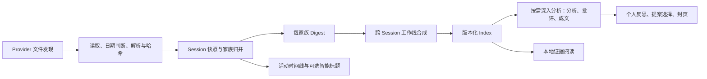
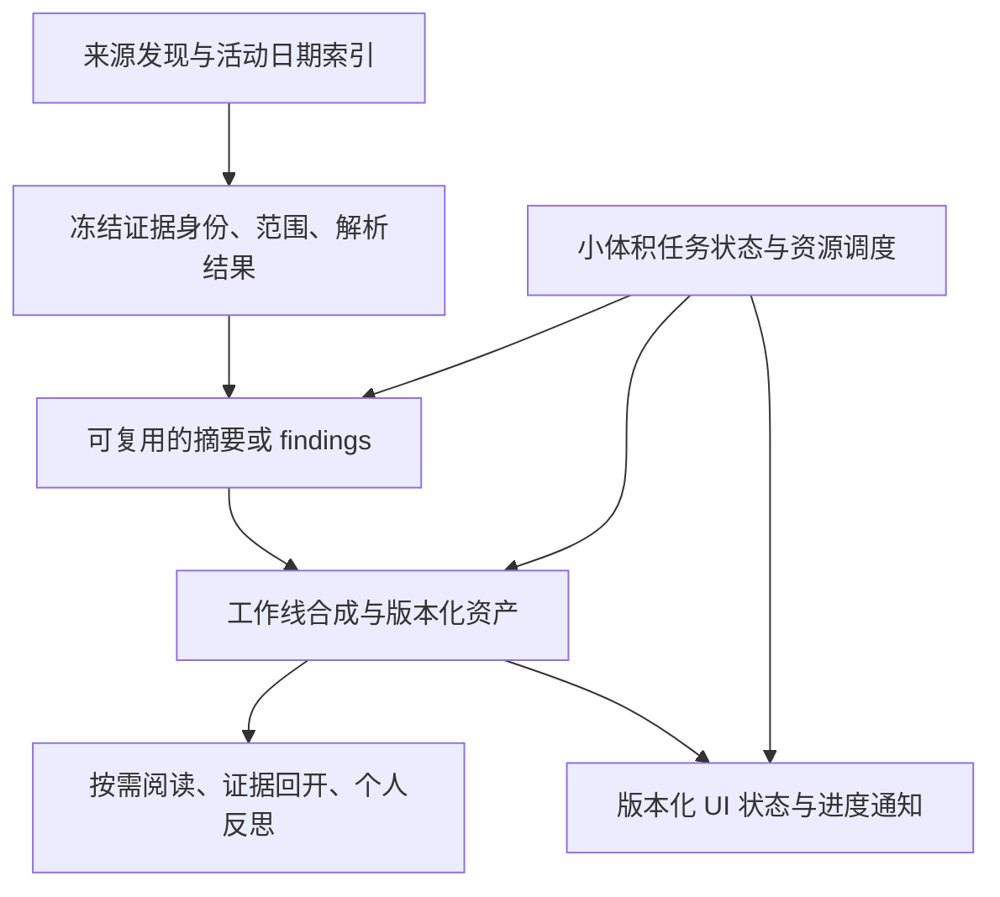

# Agent Notebook 全链路复核与架构建议

对象：2026-09-06 当前工作区，HEAD `0a31fac`，package version `0.7.2`，包含原有未提交改动。此次为审查，没有修改业务代码。已有同日报告与探针作为线索；下述反例重新执行，不直接沿用其运行结论。

**结论：当前更需要修复证据、状态和成本边界，而不是增加流水线节点或更换框架。现有类型化工作流与不可变版本有保留价值，但还不宜称为体验、可靠性和性能都已完成的最终版。**

## 产品范围与实际链路

审查的是仓库当前默认桌面实现，不是已安装包的字节级验收。主路径为 Electron main → IPC → React，模型通过本地 Provider CLI 执行。

默认 V1 开关在 `app/desktop/main.ts:104`；V2 仅在非打包环境显式开启，不能把候选能力当成默认产品能力。

| 用户描述的阶段 | 当前实现 | 需要避免的误判 |
| --- | --- | --- |
| 结构化 | Zod 输入输出、版本化 Index/Dossier、关系校验 | JSON 合法不等于语义正确 |
| 预筛 | 日期、文件/目录预算、会话解析、家族归并 | 读取预算不能代表重要性筛选 |
| 精选 | 工作线合成以及用户选择工作线深入分析 | 当前没有独立语义精选/排序层 |
| 摘要 | 家族 Digest；另有 Session 智能标题 | 两条路径用途不同，但会重复读取和调用模型 |
| 事件 | Provider 事件支撑活动投影；V2 有 atomic findings | 运行事件不是已经验证的知识事实 |
| 聚簇 | V1 synthesis 合成跨 Session 工作线 | 尚非独立聚簇服务，没必要先服务化 |

正常 Index 的模型节点调用量为 F + 1，F 为家族数；关系修复可能再加一次。一个新深入分析增加三次串行调用，反思提案整理增加一次。展开已有 Session、重开已有 Dossier 不需要模型。该计数不代表 Provider 内部工具调用或推理轮数。

产品愿景与当前实现也应分开：最终知识系统不能把所有来源都强制经过 Today 的反思/封页仪式。当前提案界面明确只记录选择，不能把它视为已经完成 Wiki 自动维护闭环。

## 已重新验证的问题

P1：证据可靠性、输入丢失或主要功能失效；P2：可用性、性能和规模增长问题。探针断言的是错误现象，探针通过不代表功能正确。

| 级别 | 问题与影响 | 本次证据 | 最小修复方向 |
| --- | --- | --- | --- |
| P1 | 输入裁剪复制消息并突破预算，增加费用、超时和证据偏重 | 4000 条短消息变成 8001 条；最终 1,364,469 字符，上限声明 240,000 | 按序列化成本裁剪；源位置不重叠；最终载荷重新验限 |
| P1 | 摘要暂时失败后普通重试仍失败 | Provider 已恢复，第二次新增调用数为 0 | 区分节点异常恢复与终局业务失败；仅重做失败家族 |
| P1 | 刷新旧请求覆盖新日期和同期设置 | 受控异步执行原始 refreshSnapshot，B 先完成、A 后完成，最终回到 A，设置回退 | 发布用请求版本与来源配置校验；从最新状态合并；前端忽略过期响应 |
| P1 | 深入分析缺少宿主保证的原文输入 | Index 后删除合成源文件，三次深入分析 prompt 均无唯一事实，假模型仍能发布 | 宿主读取并验证冻结片段；缺失显式记录；不能把合法 ID 当成已读证据 |
| P1 | 子 Agent 引用不可回开 | child evidence 已在 Index 中，可点击目标数为 0，授权拒绝 | 统一 transcript 证据身份；家族关系独立表达；引用和授权共用解析 |
| P1 | 历史日被较新文件挤出扫描预算 | 1 个真实目标日文件 + 180 个较新文件，返回 0 Session，warnings 为空 | 目标日期优先；跨日补查单独预算；展示发现范围完整性 |
| P1 | 正常导航丢失未保存反思 | 真实 Electron：输入 → Sources → 今日 → 重开，文本为空 | 草稿按日期、版本、工作线存于组件卸载之外；正式提交仍受版本校验 |
| P2 | 单条消息截断但整体仍称未截断 | 81000 字符变成 80018，truncated=false | 单条、总量、文件三类截断均传播到覆盖状态 |
| P2 | 无变化输入再次准备仍重复 Digest | 一家族第一次 2 次调用，第二次仍 2 次 | 复用成功且身份一致的家族 Digest；新证据仅重算变化家族 |
| P2 | 高频进度更新重写所有历史资产 | 一家族成功生成有 7 次仓库发布；历史越大，每次 mutation 越慢 | 分离运行进度与不可变内容；合并广播；小体积状态推送 |

定位与更完整复现解释见同目录 `full-chain-2026-09-06.md`。本次逐项核验的主要位置为：

- 输入预算：`app/desktop/structured-today-input.ts:338`、`:398`。
- 重试：`app/desktop/structured-today-runtime.ts:137`、`src/structured-today-langgraph.ts:552`。
- 刷新与广播：`app/desktop/main.ts:1146`、`:1286`、`:1291`。
- 原文接入：`src/structured-today-langgraph.ts:234` 起的 gather/analyze/critique。
- 子证据身份：`app/desktop/structured-today-input.ts:80`。
- 发现预算：`src/agent-sessions.ts:410`、`:489`、`:889`。
- 草稿：`app/desktop/structured-today-index-view.tsx:306`、`:363`。

深入分析的结论边界：CLI 具有文件读取能力，测试不能证明真实模型从不读取原文；确认的是宿主没有把“读了哪份冻结内容、是否校验成功”纳入输入契约。三轮输出互相检查不能替代这一保证。

## 性能证据与另外的静态风险

仓库基准：合成历史版本，每版约 9500 字符 summary；使用真实复制、校验、序列化代码，磁盘 IO 为 stub，三次取中位数。

| 历史版本数 | 紧凑 JSON | 单次进度 mutation | 每次写出字节数 |
| --- | --- | --- | --- |
| 10 | 125,614 B | 1.1 ms | 137,065 B |
| 100 | 1,251,606 B | 9.4 ms | 1,362,597 B |
| 500 | 6,256,406 B | 50.6 ms | 6,809,797 B |

这些数值不能外推为真实端到端耗时，也不包含磁盘、目录扫描、IPC 和渲染。能确定的是：当前任务的一次进度变化，其成本受全部历史数据量支配。

其他已读代码确认、尚未独立压测的风险：

1. 每次 buildState 都 findActivityDates，最多约 3600 个目录项逐个 stat。进度更新不应重复发现日期；仓库 onPublish 与业务进度回调还会重复广播。
2. 启动必须先完成 refreshSnapshot 才创建窗口；扫描逐文件读取完整字节并解析，尚无扫描侧字节预算。大量或超大 transcript 会推迟窗口出现。
3. 活动缓存对全部 Session 使用 Promise.all，缓存没有逐出；读取失败也转换成长期缓存的 lane。应限制并发与缓存生命周期，失败允许后续重试。
4. 智能标题过期结果被丢弃，但旧队列没有因此停止调度。不同工作线深入分析可以分别启动；单个 Index 的并发 3 不等于全应用并发上限。
5. `loadStore`、`loadNotebook` 将任意读入异常变成空数据；随后保存可能覆盖原数据。`persistStore`、标题缓存没有复用资产仓库的串行原子替换。尚未模拟真实磁盘故障，因此这是静态数据丢失风险。
6. 活动日期由文件 mtime/ctime 推导，不是消息活动日期。跨日长会话、复制导入可能使日历提示与正文日期不一致，应共用实际活动日期索引。
7. 阅读器直接渲染所有消息，只有字符预算，没有消息/DOM 数预算；大量短消息是需要补测的边界。先测真实 DOM/长任务，再决定分页或虚拟列表，不能仅凭代码认定已经卡顿。

Electron 官方建议先测量瓶颈、延迟不必要的启动工作并避免主进程长时间阻塞；这里的大 JSON 复制与解析即使周围使用 async，也仍有同步 CPU 成本。[Electron performance](https://www.electronjs.org/docs/latest/tutorial/performance)。Node 文档也明确提示同一文件的并行 writeFile 不安全。[Node fs](https://nodejs.org/api/fs.html)。

## 建议的收敛架构

保持本地单体与现有能力，按变化频率和数据职责重划边界：

- **原文、派生结果、用户输入、运行进度分开。** 原文是证据，摘要可重算，反思不可被生成内容覆盖，进度不值得重写历史内容。
- **冻结一次，按身份复用。** 缓存键包含内容与成员身份、日期/时区范围、解析策略、模型/函数和编辑契约版本，不能仅看 mtime。成功 checkpoint 清理不能替代结果缓存。
- **区分完整性与质量。** 每条发现记录要能解释为何纳入、排除或失败；模型可引用的片段应由宿主可重复定位。引文存在仍不自动证明语义结论正确。
- **前台响应优先。** 窗口和已有结果先可读；后台扫描与模型任务受统一预算约束；过期请求既不能覆盖状态，也应停止继续调度工作。
- **历史回放的边界应诚实。** 当前冻结哈希和范围可以验证 Provider 文件，却不是独立原文备份。源文件删除后无法凭哈希恢复；如果产品承诺永久离线知识回放，需单独设计被纳入原始来源的留存策略。

## 过度设计判断

| 设计 | 建议 | 理由 |
| --- | --- | --- |
| Zod、哈希、精确引用、CAS、原子发布 | 保留 | 正确性边界，删除会损害证据与用户原文 |
| LangGraph | 暂不替换 | 已有恢复能力；瓶颈证据指向数据流和重复工作 |
| 三轮深入分析 | 先修原文，再做单轮对照 | 没有比较测量就不能宣称批评轮必要或无用 |
| V1、V2、旧 producer 同时演进 | 收敛写入侧，保留历史读取 | 候选通过门槛后再迁移，不能直接删兼容 |
| 五类提案必需逐类处理 | 产品上评估允许空类别、只显示相关项 | 当前契约真实存在，但可能制造收口负担 |
| 独立预筛/精选/事件/聚簇模型或服务 | 暂不新增 | 中间产物应因复用或质量收益存在，不能只因概念完整而存在 |
| 全部换 SQLite、全部上 worker | 分阶段 | 先把热进度分离；只有测得持续 CPU 瓶颈才迁移重解析 |

V2 当前还有 root-only 输入和最终 Digest 400000 字符超限即失败的限制；它的 exactQuote/messageKey 方向值得保留，但不能直接替代现有家族链路，更不能宣称已通过真实语义质量验证。

## 实施顺序与验收

1. **先修失真和丢失：** 输入上限/防重复、终局失败重试、刷新竞态、草稿保留、子证据回开、存储读失败保护。对应反例改成正确行为，且不重复成功节点、不覆盖用户已保存原文。
2. **补证据闭环：** 历史日优先发现、范围缺口展示、深入分析宿主原文输入。发现覆盖率和已纳入证据分配率分别呈现。
3. **消除重复成本：** 分离进度、缓存活动日期、合并通知、Digest 复用、过期任务停调度。验收要求进度更新不扫描 transcript、不遍历目录、不重写历史资产；仅变更家族触发新 Digest。
4. **再做架构删减：** 用同一真实材料集比较单轮/三轮、V1/V2，测证据支持率、遗漏、错误合并/拆分、费用与延迟，再决定模型节点与旧写入路径退役。

性能基线至少记录首次窗口可见时间、日期切换 p50/p95、主进程长任务、扫描字节数、状态推送大小、进度写入量、Digest 命中率与模型调用数。先在真实设备和典型/大型材料上建立基线，再定绝对 SLA；本次未测得“最优架构”或优化后的提速比例。

## 本次实际检查

- 11 个相关 Node 测试文件，59 项通过。
- 同日审查的 9 项 Node 反例/合成基准重新执行，全部重现。
- `npm run typecheck` 通过；`npm run build:desktop` 通过。
- 在原 Electron 完整 closeout 测试中加入导航草稿反例，1 项通过；同时走完整理、引用、保存反思、提案、封页、重启回放。使用临时 profile 和假 Provider。
- 未执行真实 Provider 质量评估、真实用户全量数据压测、签名归档/发布或完整 release gates。
- 没有更换模型、修改业务逻辑或覆盖原有审查文件；临时测试副本运行后删除。

Node 复现必须按原报告把 integration fixtures 与探针拼接在 tests 目录再运行；探针不是独立测试文件。直接执行 docs 下的 probes 文件会因相对导入和 fixture 上下文缺失而失败，本次发现后按原报告命令重跑成功。
